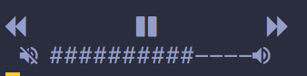

# lofi
A rust project to play youtube playlists from the command line!

## Description
- Play youtube playlists - podcasts, music, etc. with play/pause/skip controls and volume controls
- Run as a background process and send messages to control it
  
## Installation

### Dependencies
- [youtube-dl](https://github.com/ytdl-org/youtube-dl)
- ffmepg, avconv, ffprobe, or avprobe (see youtube-dl)
- [rust](https://www.rust-lang.org/tools/install) (use rustup - it needs cargo!)
- A [nerd font](https://github.com/ryanoasis/nerd-fonts) - the TUI won't render properly without one but it'll still be usable. Direct output to `/dev/null` if you're not using one.

### Steps
You will have to build it from source with the given makefile:
1. Clone with `git clone https://github.com/Who23/lofi.git`
2. Run `make install`
3. Take the binary at `DIRECTORY/target/release/lofi` and put it in your `~/.local/bin` or `/usr/local/bin`

## Usage
### Flags
- `-p <PLAYLIST>` will play a playlist given a playlist id (gotten from `?list=<PLAYLIST>` in a youtube url) or an alias (see below)
- `-d` will accept input from messages so that lofi can run in the background
- `-m <MESSAGE>` sends a message with the following options (This only works when given the `-d` flag): 
  - next - skips the current song
  - previous - goes back to the previous song
  - toggle - plays/pauses the song
  - volup - increases the volume
  - voldown - decreases the volume
  - quit - quits lofi
  
### Keybinds
These apply when `-d` flag is not given
- `j` - previous song
- `k` - play/pause song
- `l` - skips song
- `=` - increase volume
- `-` - decrease volume
- `^C` - quit lofi

## Configuration
These can be put in the config file at `~/.config/lofi/config`
- `alias=<SHORTHAND>=<PLAYLIST>` where shorthand is a shorthand like `rock` and playlist is a playlist ID. The shorthand can then be used with the `-p` flag
- `playlist=<PLAYLIST>` sets the default playlist given a playlist ID

## Closing
This project isn't super polished since I made it to learn rust but I wanted to try and make it usable! It's pretty buggy but please leave any issues or suggestions if you'd like! 

